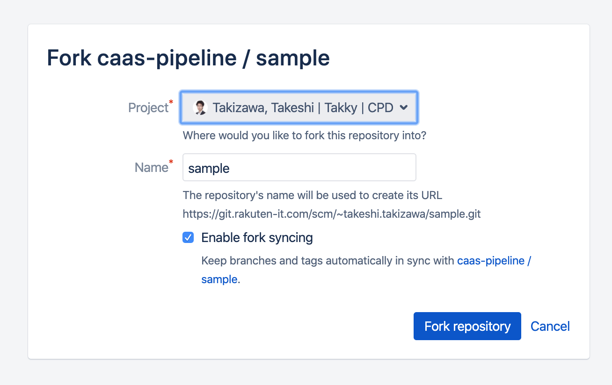
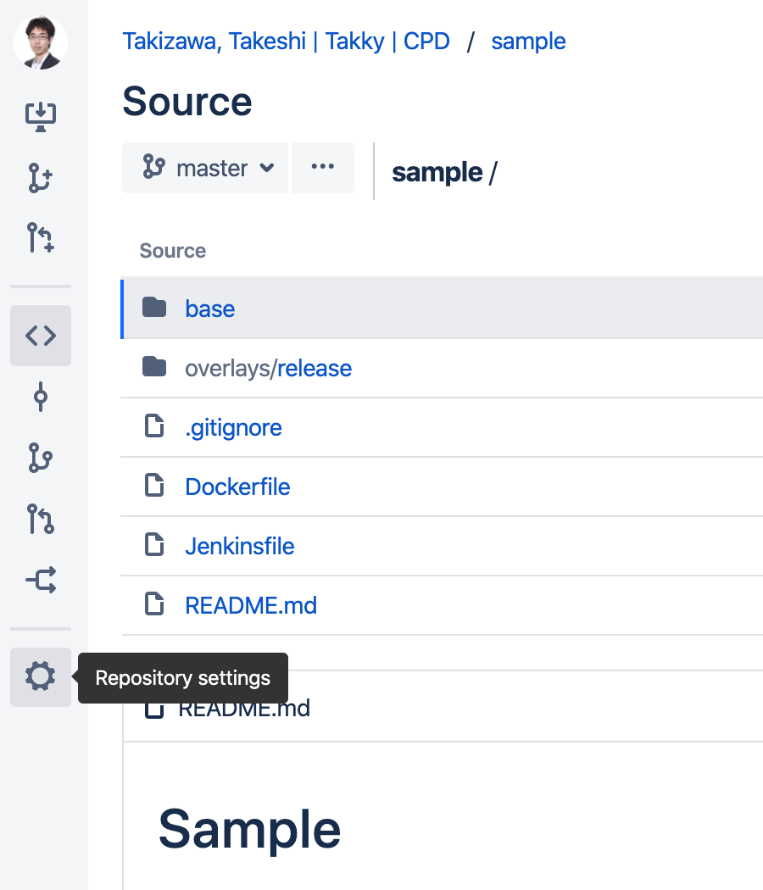
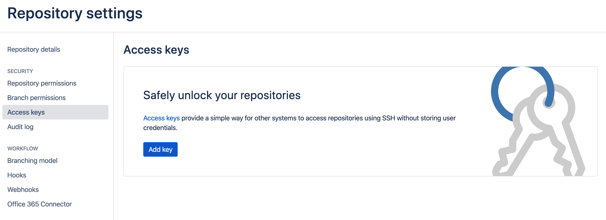
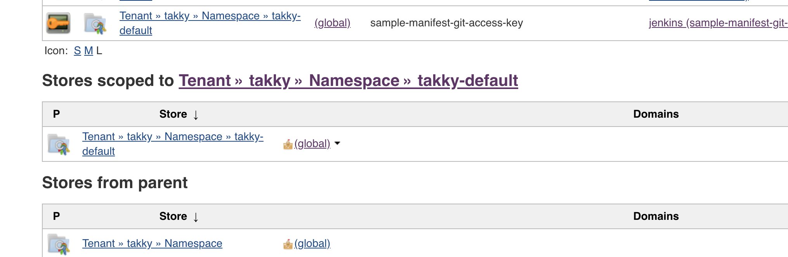
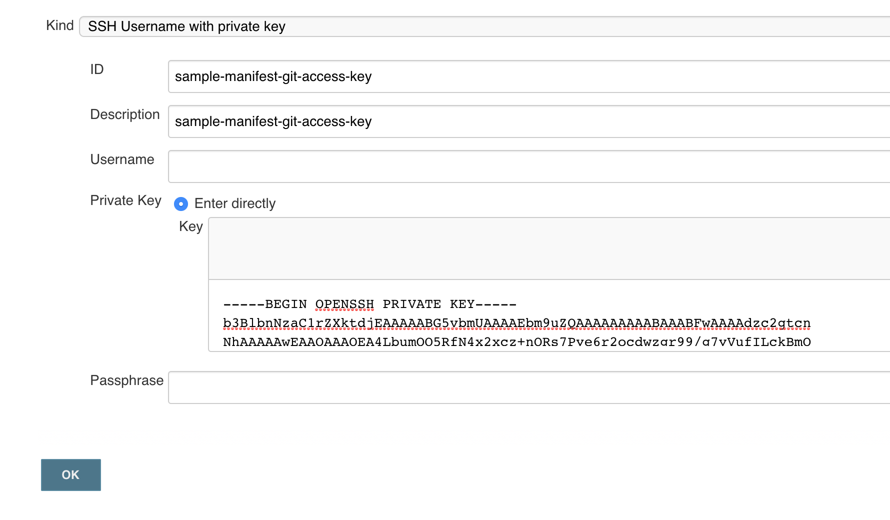
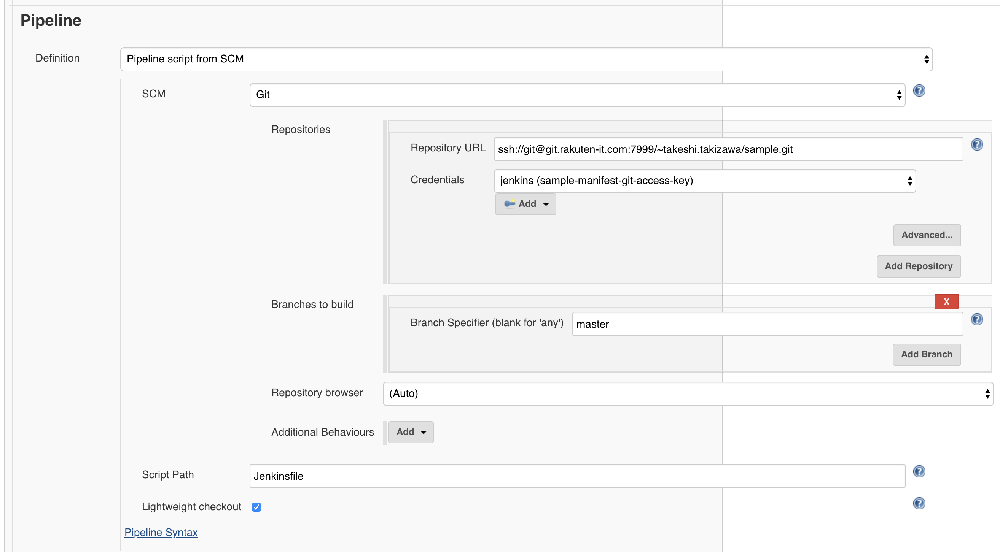
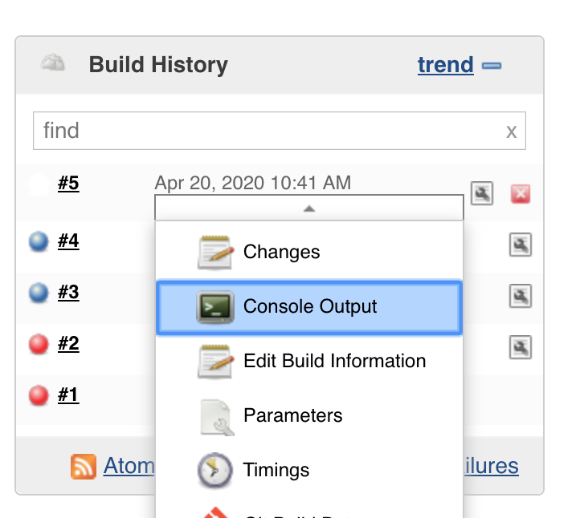
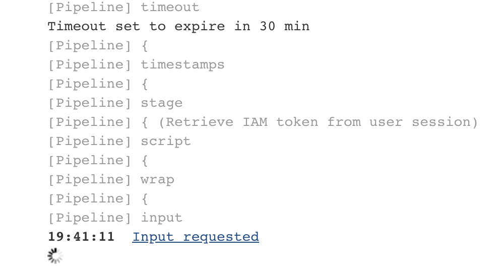

Create deploy job
=================

1. Generate ssh keypair
1. Fork this repository
1. Register public key as access key
1. Register private key as Jenkins ssh credentials
1. Create Jenkins pipeline job

## Generate ssh keypair

Execute following command to generate ssh keypair please.

```
$ ssh-keygen -C sample-manifest -N '' -t rsa -f id_rsa.sample-manifest
```

Then `id_rsa.sample-manifest` and `id_rsa.sample-manifest.pub` should be generated.

## Fork this repository

* Go to https://git.rakuten-it.com/projects/CAASPIPELINE/repos/sample/forks
* Fork under your project. e.g. https://git.rakuten-it.com/users/takeshi.takizawa/repos/sample/browse



## Register public key as access key

* Go to repository setting page. e.g. https://git.rakuten-it.com/users/takeshi.takizawa/repos/sample/settings



* Go to access keys page. e.g. https://git.rakuten-it.com/plugins/servlet/ssh/projects/~TAKESHI.TAKIZAWA/repos/sample/keys



* Add new access key `id_rsa.sample-manifest.pub` which created in Generate ssh keypair step

## Register private key as Jenkins ssh credentials

* Go to your namespace folder in the Jenkins. e.g. https://jenkins-jpe1z-beta.r-local.net/jenkins/job/Tenant/job/takky/job/Namespace/job/takky-default/
* Click `Credentials` in left navigation
* Scroll untill `Stores scoped to Tenant » ${TENANT_NAME} » Namespace » ${NAMESPACE}`
* Click `(global)`



* Click `Add Credentials` in left navigation
* Select kind `SSH Username with private key`
* ID: sample-manifest-git-access-key, Description: sample-manifest-git-access-key, Private Key: COPY CONTENT OF `id_rsa.sample-manifest`
* Click OK button



## Create Jenkins pipeline job

* Go to Apps folder of your namespace in the Jenkins. e.g. https://jenkins-jpe1z-beta.r-local.net/jenkins/job/Tenant/job/takky/job/Namespace/job/takky-default/job/Apps/
* Click `New Item`
* item name: sample, job type: Pipeline
* Click OK button
* Scroll until Pipeline section
* Select `Pipeline script from SCM`, SCM: Git, Repository URL: SSH_URL_OF_SAMPLE_REPO, Credentials: `Jenkins (sample-manifest-git-access-key)`
* Click Save button



## Test

* Go to sample app folder. e.g. https://jenkins-jpe1z-beta.r-local.net/jenkins/job/Tenant/job/takky/job/Namespace/job/takky-default/job/Apps/job/sample/
* Click `Build Now`. Since parameters in Jenkinsfile is not reflected yet, first build is failed.
* Click `Build with Parameters`
* Select ENVIRONMENT and K8S_CLUSTER_ID
* Click `Build` button
* Click `Console Output` of the build



* Click `Input requested`



* Check username if it's okay click `Proceed`
* Deployment should be succeeded!
